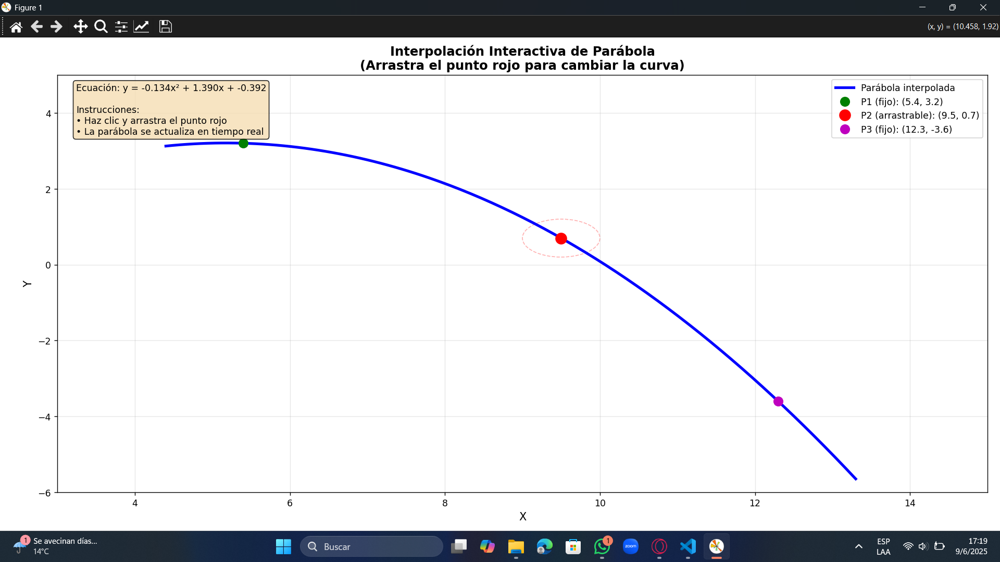
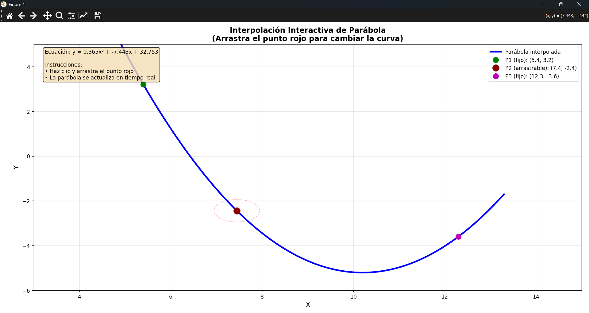
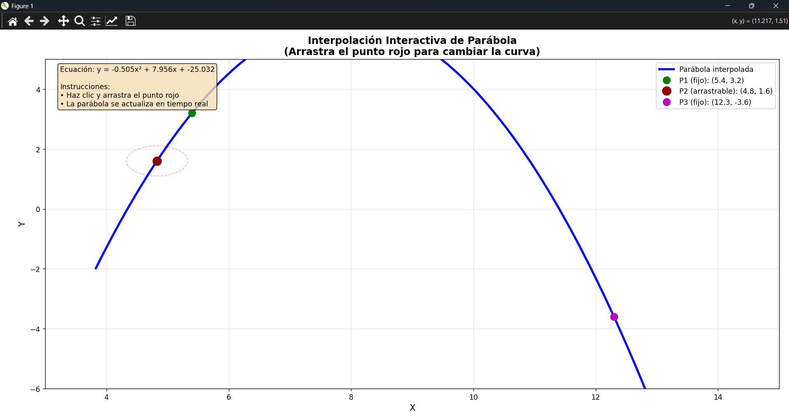
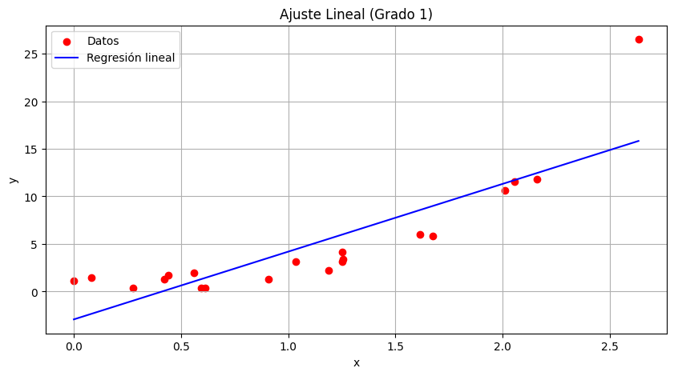
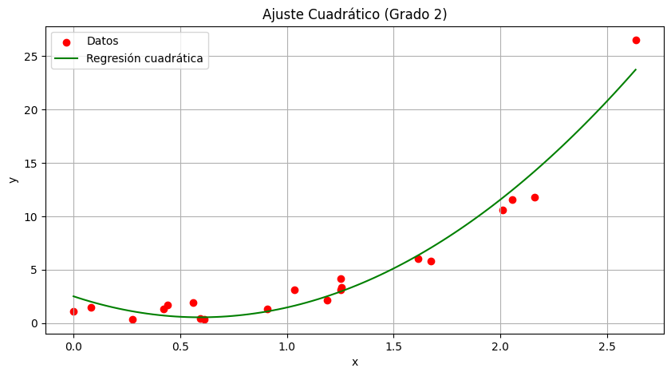

# [Taller 05] Mínimos cuadrados

- INTEGRANTES: Richard Tipantiza y Jairo Angulo

[Repositorio del Taller](https://github.com/keyaru18/Taller04_M-nimos_Cuadrados.git)

## A)  Interpole los puntos:

$p_1 = (5.4, 3.2)$

$p2_i = (9.5, 0.7)$

$p3 = (12.3, -3.6)$

De estos, el punto $p2_i$ debe ser seleccionable y movible. Cree un programa que interpole una parábola en tiempo real para los tres puntos. 

```python
import matplotlib.pyplot as plt
import numpy as np
from matplotlib.patches import Circle

class InteractiveParabola:
    def __init__(self):
        # Puntos iniciales
        self.p1 = np.array([5.4, 3.2])
        self.p2 = np.array([9.5, 0.7])  # Punto interactivo
        self.p3 = np.array([12.3, -3.6])
        
        # Variables para el arrastre
        self.dragging = False
        self.drag_threshold = 0.5  # Distancia mínima para detectar click en punto
        
        # Configurar la figura
        self.fig, self.ax = plt.subplots(figsize=(12, 8))
        self.ax.set_title('Interpolación Interactiva de Parábola\n(Arrastra el punto rojo para cambiar la curva)', 
                         fontsize=14, fontweight='bold')
        self.ax.grid(True, alpha=0.3)
        self.ax.set_xlabel('X', fontsize=12)
        self.ax.set_ylabel('Y', fontsize=12)
        
        # Inicializar elementos gráficos
        self.setup_plot()
        
        # Conectar eventos
        self.fig.canvas.mpl_connect('button_press_event', self.on_press)
        self.fig.canvas.mpl_connect('motion_notify_event', self.on_motion)
        self.fig.canvas.mpl_connect('button_release_event', self.on_release)
        
        # Dibujar inicialmente
        self.update_parabola()
    
    def setup_plot(self):
        """Configurar los elementos gráficos iniciales"""
        # Línea de la parábola
        self.parabola_line, = self.ax.plot([], [], 'b-', linewidth=3, label='Parábola interpolada')
        
        # Puntos fijos
        self.point1 = self.ax.plot(self.p1[0], self.p1[1], 'go', markersize=10, 
                                  label=f'P1 (fijo): ({self.p1[0]:.1f}, {self.p1[1]:.1f})')[0]
        self.point3 = self.ax.plot(self.p3[0], self.p3[1], 'mo', markersize=10, 
                                  label=f'P3 (fijo): ({self.p3[0]:.1f}, {self.p3[1]:.1f})')[0]
        
        # Punto interactivo (P2)
        self.point2 = self.ax.plot(self.p2[0], self.p2[1], 'ro', markersize=12, 
                                  label=f'P2 (arrastrable): ({self.p2[0]:.1f}, {self.p2[1]:.1f})')[0]
        
        # Círculo de ayuda visual para el punto arrastrable
        self.drag_circle = Circle((self.p2[0], self.p2[1]), self.drag_threshold, 
                                 fill=False, linestyle='--', color='red', alpha=0.3)
        self.ax.add_patch(self.drag_circle)
        
        # Configurar límites y leyenda
        self.ax.set_xlim(3, 15)
        self.ax.set_ylim(-6, 5)
        self.ax.legend(loc='upper right')
        
        # Texto informativo
        self.info_text = self.ax.text(0.02, 0.98, '', transform=self.ax.transAxes, 
                                     verticalalignment='top', fontsize=10,
                                     bbox=dict(boxstyle='round', facecolor='wheat', alpha=0.8))
    
    def interpolate_parabola(self):
        """Calcular la parábola que pasa por los tres puntos usando interpolación polinómica"""
        # Extraer coordenadas
        points = np.array([self.p1, self.p2, self.p3])
        x_points = points[:, 0]
        y_points = points[:, 1]
        
        # Usar polyfit para obtener coeficientes de la parábola (grado 2)
        coefficients = np.polyfit(x_points, y_points, 2)
        
        return coefficients
    
    def evaluate_parabola(self, x_vals, coefficients):
        """Evaluar la parábola en los puntos x dados"""
        return np.polyval(coefficients, x_vals)
    
    def update_parabola(self):
        """Actualizar la visualización de la parábola"""
        # Calcular coeficientes
        coeffs = self.interpolate_parabola()
        
        # Generar puntos para la curva suave
        x_min = min(self.p1[0], self.p2[0], self.p3[0]) - 1
        x_max = max(self.p1[0], self.p2[0], self.p3[0]) + 1
        x_curve = np.linspace(x_min, x_max, 200)
        y_curve = self.evaluate_parabola(x_curve, coeffs)
        
        # Actualizar la línea de la parábola
        self.parabola_line.set_data(x_curve, y_curve)
        
        # Actualizar la posición del punto P2 y su círculo de ayuda
        self.point2.set_data([self.p2[0]], [self.p2[1]])
        self.drag_circle.center = (self.p2[0], self.p2[1])
        
        # Actualizar etiquetas
        self.ax.legend([self.parabola_line, self.point1, self.point2, self.point3],
                      ['Parábola interpolada',
                       f'P1 (fijo): ({self.p1[0]:.1f}, {self.p1[1]:.1f})',
                       f'P2 (arrastrable): ({self.p2[0]:.1f}, {self.p2[1]:.1f})',
                       f'P3 (fijo): ({self.p3[0]:.1f}, {self.p3[1]:.1f})'],
                      loc='upper right')
        
        # Mostrar ecuación de la parábola
        a, b, c = coeffs
        equation = f'Ecuación: y = {a:.3f}x² + {b:.3f}x + {c:.3f}'
        self.info_text.set_text(f'{equation}\n\nInstrucciones:\n• Haz clic y arrastra el punto rojo\n• La parábola se actualiza en tiempo real')
        
        # Redibujar
        self.fig.canvas.draw()
    
    def distance_to_point(self, event_pos, point_pos):
        """Calcular distancia euclidiana entre posición del evento y un punto"""
        return np.sqrt((event_pos[0] - point_pos[0])**2 + (event_pos[1] - point_pos[1])**2)
    
    def on_press(self, event):
        """Manejar evento de presionar botón del mouse"""
        if event.inaxes != self.ax:
            return
        
        # Verificar si el click está cerca del punto P2
        event_pos = np.array([event.xdata, event.ydata])
        distance = self.distance_to_point(event_pos, self.p2)
        
        if distance <= self.drag_threshold:
            self.dragging = True
            # Cambiar cursor y color del punto
            self.fig.canvas.set_cursor(1)  # Cursor de mano
            self.point2.set_color('darkred')
            self.fig.canvas.draw()
    
    def on_motion(self, event):
        """Manejar evento de movimiento del mouse"""
        if not self.dragging or event.inaxes != self.ax:
            return
        
        # Actualizar posición del punto P2
        self.p2[0] = event.xdata
        self.p2[1] = event.ydata
        
        # Actualizar la parábola
        self.update_parabola()
    
    def on_release(self, event):
        """Manejar evento de soltar botón del mouse"""
        if self.dragging:
            self.dragging = False
            # Restaurar cursor y color del punto
            self.fig.canvas.set_cursor(0)  # Cursor normal
            self.point2.set_color('red')
            self.fig.canvas.draw()
    
    def show(self):
        """Mostrar la ventana interactiva"""
        plt.tight_layout()
        plt.show()

# Crear y ejecutar la aplicación
if __name__ == "__main__":
    app = InteractiveParabola()
    print("Programa de Interpolación Interactiva de Parábola")
    print("=" * 50)
    print("Instrucciones:")
    print("• Haz clic y arrastra el punto rojo (P2) para mover la parábola")
    print("• La ecuación cuadrática se actualiza automáticamente")
    print("• Los puntos verde (P1) y magenta (P3) son fijos")
    print("• Cierra la ventana para terminar el programa")
    print("=" * 50)
    
    app.show()
```
## Resultados







## B) Interpole el siguiente conjunto de datos:
xs = [
    0.0003,
    0.0822,
    0.2770,
    0.4212,
    0.4403,
    0.5588,
    0.5943,
    0.6134,
    0.9070,
    1.0367,
    1.1903,
    1.2511,
    1.2519,
    1.2576,
    1.6165,
    1.6761,
    2.0114,
    2.0557,
    2.1610,
    2.6344,
]
ys = [
    1.1017,
    1.5021,
    0.3844,
    1.3251,
    1.7206,
    1.9453,
    0.3894,
    0.3328,
    1.2887,
    3.1239,
    2.1778,
    3.1078,
    4.1856,
    3.3640,
    6.0330,
    5.8088,
    10.5890,
    11.5865,
    11.8221,
    26.5077,
]


```python
import numpy as np
import matplotlib.pyplot as plt

# Datos
xs = [0.0003, 0.0822, 0.2770, 0.4212, 0.4403, 0.5588, 0.5943, 0.6134, 0.9070, 1.0367,
      1.1903, 1.2511, 1.2519, 1.2576, 1.6165, 1.6761, 2.0114, 2.0557, 2.1610, 2.6344]
ys = [1.1017, 1.5021, 0.3844, 1.3251, 1.7206, 1.9453, 0.3894, 0.3328, 1.2887, 3.1239,
      2.1778, 3.1078, 4.1856, 3.3640, 6.0330, 5.8088, 10.5890, 11.5865, 11.8221, 26.5077]

x = np.array(xs)
y = np.array(ys)

# ==============================================
# 1. FUNCIÓN PARA AJUSTE LINEAL (GRADO 1)
# ==============================================
def ajuste_lineal():
    print("\n=== AJUSTE LINEAL (GRADO 1) ===")
    print("\nFunción objetivo a minimizar:")
    print("S(θ₀, θ₁) = Σ(yᵢ - (θ₀ + θ₁xᵢ))²")
    
    # Construir matriz X para grado 1
    X1 = np.column_stack([np.ones(len(x)), x])
    
    # Mostrar sistema de ecuaciones normales
    print("\nSistema de ecuaciones normales:")
    print("nθ₀ + θ₁Σxᵢ = Σyᵢ")
    print("θ₀Σxᵢ + θ₁Σxᵢ² = Σxᵢyᵢ")
    
    # Calcular sumatorias para mostrar
    n = len(x)
    sum_x = sum(x)
    sum_y = sum(y)
    sum_x2 = sum(x**2)
    sum_xy = sum(x*y)
    
    print("\nValores calculados:")
    print(f"n = {n}")
    print(f"Σxᵢ = {sum_x:.4f}")
    print(f"Σyᵢ = {sum_y:.4f}")
    print(f"Σxᵢ² = {sum_x2:.4f}")
    print(f"Σxᵢyᵢ = {sum_xy:.4f}")
    
    print("\nSistema numérico:")
    print(f"{n}θ₀ + {sum_x:.4f}θ₁ = {sum_y:.4f}")
    print(f"{sum_x:.4f}θ₀ + {sum_x2:.4f}θ₁ = {sum_xy:.4f}")

    # Calcular (XᵀX) y (Xᵀy)
    XT_X1 = X1.T @ X1
    XT_y1 = X1.T @ y

    # Resolver sistema
    theta1 = np.linalg.solve(XT_X1, XT_y1)

    # Resultados
    print(f"\nSolución del sistema:")
    print(f"θ₀ = {theta1[0]:.4f}")
    print(f"θ₁ = {theta1[1]:.4f}")
    print(f"\nEcuación final: y = {theta1[1]:.4f}x + {theta1[0]:.4f}")

    # Gráfico
    plt.figure(figsize=(10, 5))
    plt.scatter(x, y, color='red', label='Datos')
    x_line = np.linspace(min(x), max(x), 100)
    y_line = theta1[1]*x_line + theta1[0]
    plt.plot(x_line, y_line, 'b-', label=f'Regresión lineal')
    plt.title("Ajuste Lineal (Grado 1)")
    plt.xlabel("x")
    plt.ylabel("y")
    plt.legend()
    plt.grid(True)
    plt.show()

# ==============================================
# 2. FUNCIÓN PARA AJUSTE CUADRÁTICO (GRADO 2)
# ==============================================
def ajuste_cuadratico():
    print("\n=== AJUSTE CUADRÁTICO (GRADO 2) ===")
    print("\nFunción objetivo a minimizar:")
    print("S(θ₀, θ₁, θ₂) = Σ(yᵢ - (θ₀ + θ₁xᵢ + θ₂xᵢ²))²")
    
    # Construir matriz X para grado 2
    X2 = np.column_stack([np.ones(len(x)), x, x**2])
    
    # Mostrar sistema de ecuaciones normales
    print("\nSistema de ecuaciones normales:")
    print("nθ₀ + θ₁Σxᵢ + θ₂Σxᵢ² = Σyᵢ")
    print("θ₀Σxᵢ + θ₁Σxᵢ² + θ₂Σxᵢ³ = Σxᵢyᵢ")
    print("θ₀Σxᵢ² + θ₁Σxᵢ³ + θ₂Σxᵢ⁴ = Σxᵢ²yᵢ")
    
    # Calcular sumatorias para mostrar
    n = len(x)
    sum_x = sum(x)
    sum_y = sum(y)
    sum_x2 = sum(x**2)
    sum_x3 = sum(x**3)
    sum_x4 = sum(x**4)
    sum_xy = sum(x*y)
    sum_x2y = sum(x**2 * y)
    
    print("\nValores calculados:")
    print(f"n = {n}")
    print(f"Σxᵢ = {sum_x:.4f}")
    print(f"Σyᵢ = {sum_y:.4f}")
    print(f"Σxᵢ² = {sum_x2:.4f}")
    print(f"Σxᵢ³ = {sum_x3:.4f}")
    print(f"Σxᵢ⁴ = {sum_x4:.4f}")
    print(f"Σxᵢyᵢ = {sum_xy:.4f}")
    print(f"Σxᵢ²yᵢ = {sum_x2y:.4f}")
    
    print("\nSistema numérico:")
    print(f"{n}θ₀ + {sum_x:.4f}θ₁ + {sum_x2:.4f}θ₂ = {sum_y:.4f}")
    print(f"{sum_x:.4f}θ₀ + {sum_x2:.4f}θ₁ + {sum_x3:.4f}θ₂ = {sum_xy:.4f}")
    print(f"{sum_x2:.4f}θ₀ + {sum_x3:.4f}θ₁ + {sum_x4:.4f}θ₂ = {sum_x2y:.4f}")

    # Calcular (XᵀX) y (Xᵀy)
    XT_X2 = X2.T @ X2
    XT_y2 = X2.T @ y

    # Resolver sistema
    theta2 = np.linalg.solve(XT_X2, XT_y2)

    # Resultados
    print(f"\nSolución del sistema:")
    print(f"θ₀ = {theta2[0]:.4f}")
    print(f"θ₁ = {theta2[1]:.4f}")
    print(f"θ₂ = {theta2[2]:.4f}")
    print(f"\nEcuación final: y = {theta2[2]:.4f}x² + {theta2[1]:.4f}x + {theta2[0]:.4f}")

    # Gráfico
    plt.figure(figsize=(10, 5))
    plt.scatter(x, y, color='red', label='Datos')
    x_curve = np.linspace(min(x), max(x), 100)
    y_curve = theta2[2]*x_curve**2 + theta2[1]*x_curve + theta2[0]
    plt.plot(x_curve, y_curve, 'g-', label='Regresión cuadrática')
    plt.title("Ajuste Cuadrático (Grado 2)")
    plt.xlabel("x")
    plt.ylabel("y")
    plt.legend()
    plt.grid(True)
    plt.show()

# Llamar a las funciones para mostrar ambos ajustes
ajuste_lineal()
ajuste_cuadratico()
```

=== AJUSTE LINEAL (GRADO 1) ===

Función objetivo a minimizar:
S(θ₀, θ₁) = Σ(yᵢ - (θ₀ + θ₁xᵢ))²

Sistema de ecuaciones normales:
nθ₀ + θ₁Σxᵢ = Σyᵢ
θ₀Σxᵢ + θ₁Σxᵢ² = Σxᵢyᵢ

Valores calculados:
n = 20
Σxᵢ = 22.0372
Σyᵢ = 98.2963
Σxᵢ² = 34.8287
Σxᵢyᵢ = 183.4119

Sistema numérico:
20θ₀ + 22.0372θ₁ = 98.2963
22.0372θ₀ + 34.8287θ₁ = 183.4119

Solución del sistema:
θ₀ = -2.9314
θ₁ = 7.1209

Ecuación final: y = 7.1209x + -2.9314




=== AJUSTE CUADRÁTICO (GRADO 2) ===

Función objetivo a minimizar:
S(θ₀, θ₁, θ₂) = Σ(yᵢ - (θ₀ + θ₁xᵢ + θ₂xᵢ²))²

Sistema de ecuaciones normales:
nθ₀ + θ₁Σxᵢ + θ₂Σxᵢ² = Σyᵢ
θ₀Σxᵢ + θ₁Σxᵢ² + θ₂Σxᵢ³ = Σxᵢyᵢ
θ₀Σxᵢ² + θ₁Σxᵢ³ + θ₂Σxᵢ⁴ = Σxᵢ²yᵢ

Valores calculados:
n = 20
Σxᵢ = 22.0372
Σyᵢ = 98.2963
Σxᵢ² = 34.8287
Σxᵢ³ = 64.3852
Σxᵢ⁴ = 130.6048
Σxᵢyᵢ = 183.4119
Σxᵢ²yᵢ = 388.7867

Sistema numérico:
20θ₀ + 22.0372θ₁ + 34.8287θ₂ = 98.2963
22.0372θ₀ + 34.8287θ₁ + 64.3852θ₂ = 183.4119
34.8287θ₀ + 64.3852θ₁ + 130.6048θ₂ = 388.7867
...
θ₁ = -6.6227
θ₂ = 5.5732

Ecuación final: y = 5.5732x² + -6.6227x + 2.5068

